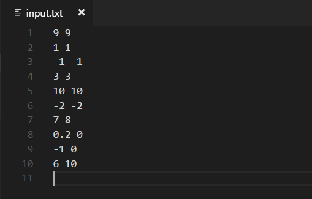
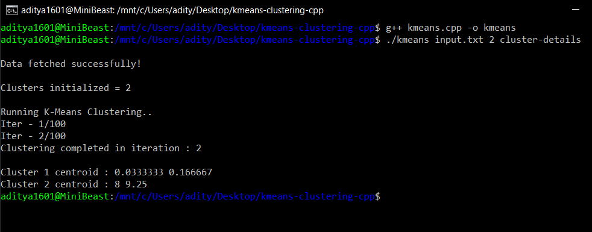
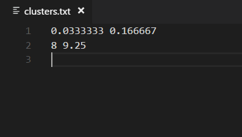

# K-Means clustering in C++

#### This is a C++ implementation of the simple K-Means clustering algorithm.

K-means clustering is a type of unsupervised learning, which is used when you have unlabeled data (i.e., data without defined categories or groups). The goal of this algorithm is to find groups in the data, with the number of groups represented by the variable K. The algorithm works iteratively to assign each data point to one of K groups based on the features that are provided. Data points are clustered based on feature similarity.

    This implementation now contains multithreading support, which speeds up calculations for large vectors and thousands of points by parallelization.

## Instructions:
The input supports any number of points and any number of dimensions. Make the "input.txt" file accordingly.

* Download the binary file "kmeans" from the repository.
* Make a file "input.txt" with all the point coordinates. The format should be as shown below (the example has 2-dimensional coordinates):

* Run the kmeans binary with the input file name, number of clusters and output directory as command line arguments, as shown below:

* The output will be 2 files in the output directory (eg: cluster-details) which contains the center point of each cluster, and cluster detail for each point.

-------------------------------
